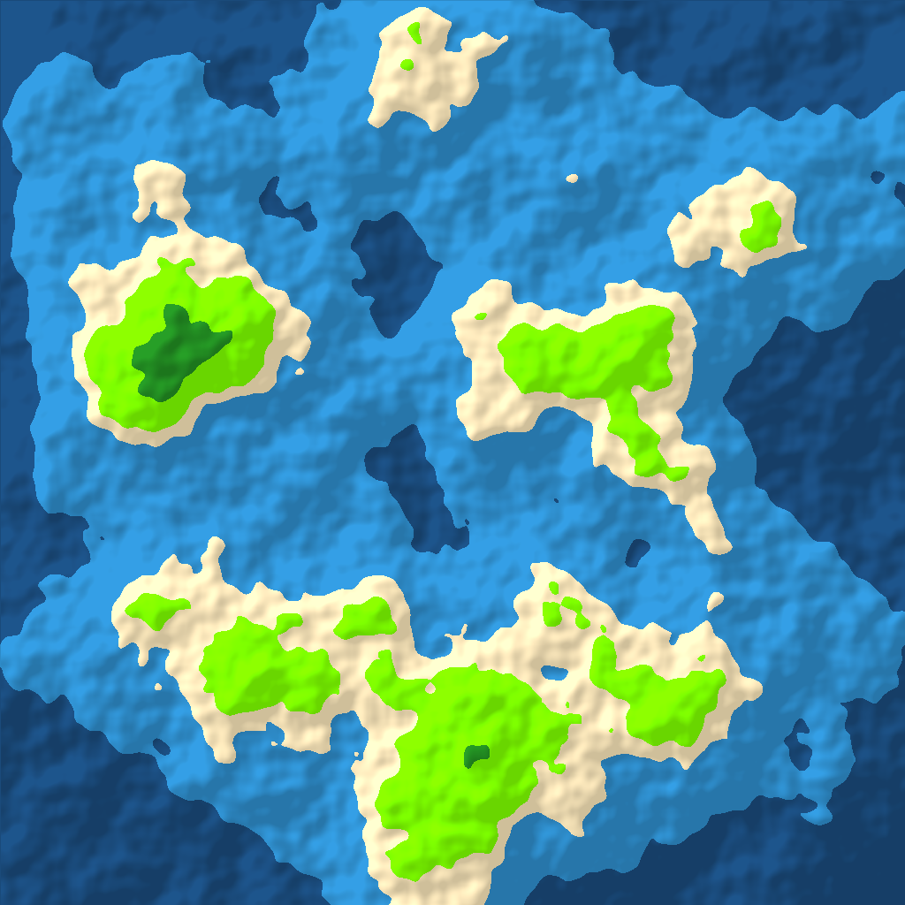
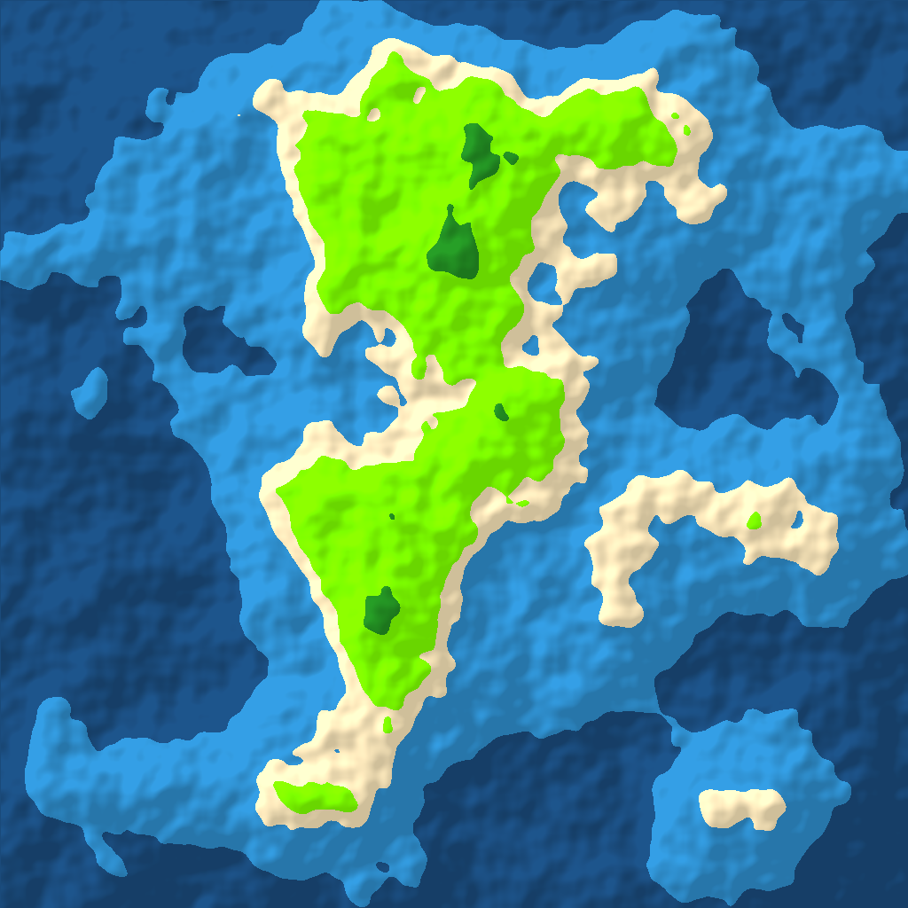
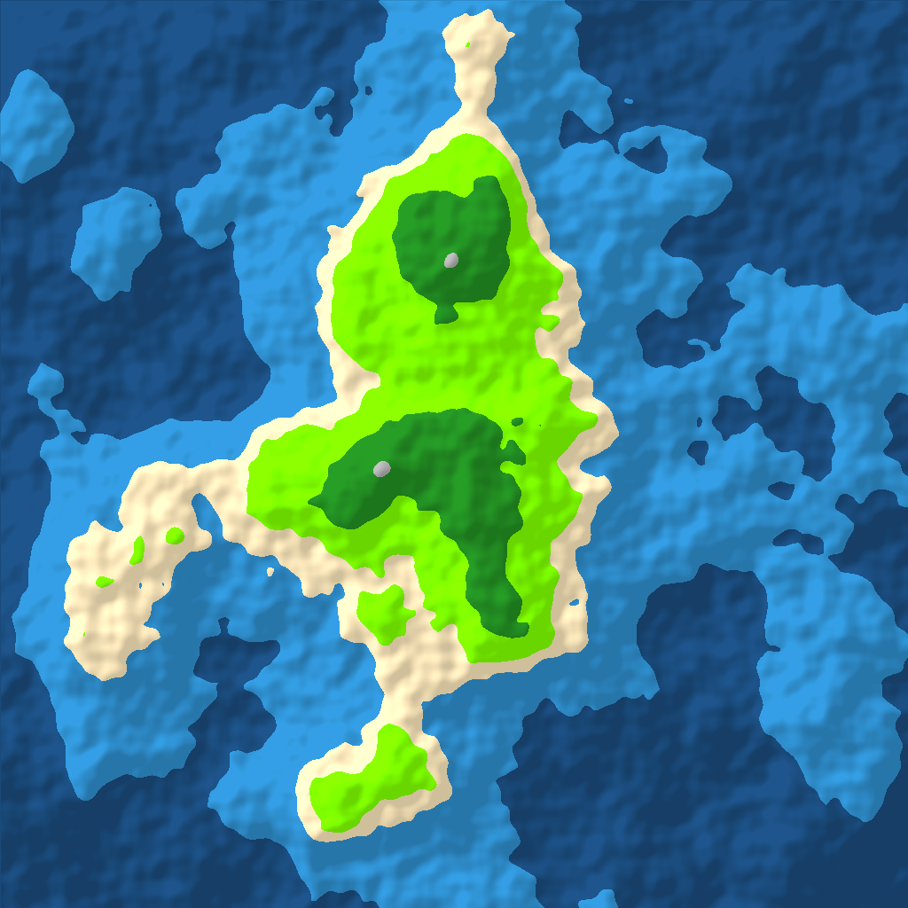

# 🗺️ WorldMapGenerator

A procedural 2D fantasy world map generator written in C#. Give it a seed, get a world.

Built with **SkiaSharp** for rendering and **FastNoiseLite** for Perlin noise generation. Every map is deterministic — the same seed always produces the same result.

---

## 🖼️ Example Output


| Seed `12345` | Seed `99999` | Seed `42` |
|:---:|:---:|:---:|
|  |   |   |

---

## ✨ Features

- **Perlin noise** with Fractal Brownian Motion (FBM) for natural-looking terrain
- **7 terrain types** — deep ocean, shallow water, beach, grassland, forest, mountain, snow peaks
- **Island falloff mask** — edges always fade to ocean, producing coherent continents
- **Elevation shading** — directional light simulation gives mountains visible depth
- **Fully reproducible** — pass any integer as a seed for identical output every run
- **Clean architecture** — 8 focused classes with clear separation of concerns

---

## 🚀 Getting Started

### Prerequisites

- [.NET 8 SDK](https://dotnet.microsoft.com/download)
- Git

### Installation

```bash
git clone https://github.com/YOUR_USERNAME/WorldMapGenerator.git
cd WorldMapGenerator
dotnet restore
```

### Running

```bash
# Generate a map with a random seed
dotnet run

# Generate a map with a specific seed
dotnet run -- 12345
```

The output PNG will be saved to `worldmap.png` in the project root. The seed used is always printed to the console.

```
Generating map with seed: 12345
Map saved to worldmap.png
```

---

## 🏗️ Architecture

The project is structured so each class has exactly one responsibility. Data flows in one direction — from raw noise values to a finished image.

```
MapConfig
    │
    ▼
NoiseGenerator ──► WorldMap ──► MapRenderer ──► output.png
                      ▲              ▲
              TerrainClassifier   ColorPalette
                      ▲
                  TerrainType (enum)
```

| File | Responsibility |
|---|---|
| `MapConfig.cs` | All tuneable settings in one place (size, seed, frequency, octaves, falloff) |
| `TerrainType.cs` | Enum of terrain categories |
| `NoiseGenerator.cs` | Wraps FastNoiseLite — the only class that touches the noise library |
| `TerrainClassifier.cs` | Converts a raw float noise value into a `TerrainType` |
| `ColorPalette.cs` | Maps each `TerrainType` to an `SKColor` |
| `WorldMap.cs` | 2D grid of terrain and height data |
| `MapRenderer.cs` | Converts a `WorldMap` into an `SKBitmap` and saves it |
| `Program.cs` | Entry point — wires classes together, ~20 lines |

---

## ⚙️ Configuration

All tuneable values live in `MapConfig.cs`. No magic numbers anywhere else.

| Setting | Default | Effect |
|---|---|---|
| `Width` / `Height` | `1024` | Output image dimensions in pixels |
| `Seed` | `1337` | Noise seed — same seed = same map |
| `Frequency` | `0.003f` | Zoom level — lower = broader, smoother features |
| `Octaves` | `5` | Noise layers — more = finer terrain detail |
| `FalloffStrength` | `3.0f` | Island shape — higher = more ocean, smaller landmass |
| `OutputPath` | `"..\..\..\output\worldmap.png"` | Where the final image is saved |

---

## 🧠 How It Works

### Noise → Terrain

Every pixel's terrain is determined by a single float sampled from a Perlin noise function at its (x, y) coordinate. That float is passed through a threshold check to produce a `TerrainType`:

```
-1.0  ──────────────────────────────────────────  1.0
  │  Deep  │ Shallow │Beach│ Grass │Forest│ Mtn │Snow│
```

### Island Falloff

Before classifying terrain, a falloff value is subtracted from the raw noise based on each pixel's distance from the map center. Pixels near the edges are pushed below ocean level regardless of noise, ensuring the landmass never runs off the edge of the image.

### Elevation Shading

After base colors are applied, each land pixel is compared to its upper-left neighbor. If the neighbor is higher, the pixel is in shadow and darkened. If lower, it catches light and is brightened. This single pass creates the illusion of a light source and gives mountains visible relief.

---

## 🛣️ Roadmap / Stretch Goals

- [ ] **Biome system** — second moisture noise layer + 2D biome lookup (temperature × moisture)
- [x] **Rivers** — downhill flow with Perlin noise-influenced meanders, variable width, and Catmull-Rom spline smoothing *(developed with [Claude](https://claude.ai))*
- [ ] **Named regions** — flood-fill landmass detection + procedural fantasy name generation
- [ ] **Animated export** — GIF showing map built up layer by layer

---

## 🧰 Built With

- [C# / .NET 8](https://dotnet.microsoft.com/)
- [SkiaSharp](https://github.com/mono/SkiaSharp) — 2D rendering and PNG export
- [FastNoiseLite](https://github.com/Auburn/FastNoiseLite) — Simplex/Perlin noise generation
- [Claude](https://claude.ai) — AI pair programmer (river generation system)

---

## 📄 License

MIT — do whatever you want with it.

---

> *Inspired by the procedural generation techniques used in roguelike games. Built as a C# portfolio project.*
